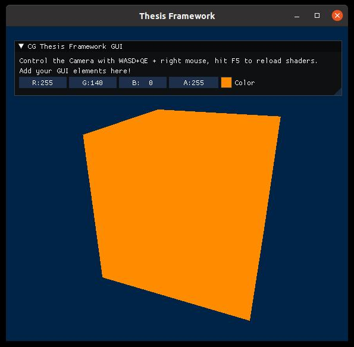

# OpenGL Thesis Framework



This is a lightweight C++ project setup for OpenGL projects. If you have any questions or suggestions, please contact me at [max.piochowiak@kit.edu](mailto:max.piochowiak@kit.edu)

## Dependencies

The project is defined using [CMake](https://cmake.org/) and uses

* [GLFW](https://www.glfw.org/) to create windows and rendering surfaces
* [Glad](https://github.com/Dav1dde/glad) for providing an OpenGL 3.3 Core profile
* [Dear Imgui](https://github.com/ocornut/imgui) for the graphical user interface (GUI)
* [OpenGL](https://www.opengl.org) as the graphics API
* [glm](https://github.com/g-truc/glm) as OpenGL Mathematics library for vector and matrix operations

## Installation Instructions

Glad and Imgui are directly included as source files in the `ext/` directory and build at compile time. For the rest of the dependencies, you have to provide the libraries through local installations:

### Ubuntu / Debian / Unix

All libraries can be installed from the package manager. Open a terminal and install

`sudo apt install build-essential cmake libgl1-mesa-dev libglfw3-dev libglm-dev`

If you want to configure the CMake project with a GUI application you can optionally add

`sudo apt install cmake-qt-gui`


### Windows

ToDo: Install CMake, GLFW, CMake, glm and OpenGL libraries.


## Build Instructions

You can build the project from the console or alternatively use an IDE for developing and building:

### From the Console 

One advantage of CMake are out of source builds, i.e. creating all build files in a separate directory. Since this is good practice we create a build sub-directory, use CMake to create our make file and then build the project with make:

```
mkdir build-debug
cd build-debug
cmake -DCMAKE_BUILD_TYPE=Debug ..
make
```

You can then run the application from the build directory with

`./thesis-framework`

### Using an IDE

Alternatively, you can import the CMakeLists.txt file from the base directory in an IDE that supports CMake, for example [CLion](https://www.jetbrains.com/de-de/clion/) or [Visual Studio](https://visualstudio.microsoft.com/de/free-developer-offers/).
If you are using Visual Studio you can use the CMake GUI program to create Visual Studio project files from the `CMakeLists.txt`.


## Usage and Development

The project already defines a simple render loop with exemplary GUI.
You can extend the functionality with own files and shaders.
Note that when creating new C++ header and source files, you have to add them to the SOURCES and HEADERS variables in the base CMakeLists.txt file and run CMake again to include them in the build.
Shader files technically don't have to be added since they are not part of the C++ build and instead read and compiled at runtime.
If you want to rename the project, simply change the title in the project(..) definition at the top of the CMakeLists.txt.

The default project structure renders a simple cube:
* `main.cpp` initializes the OpenGL window and context and defines the main GLFW render loop and the ImGUI.
* `camera.cpp` implements a basic spherically controlled camera 
* `renderer.cpp` initializes (before main loop), renders (during main loop) and cleans up (after main loop) the rendering content.
* `utils.cpp` offers utility functions, e.g. checking for OpenGL error and loading shaders from files 

## Further notes

### OpenGL Versions and Profiles
If you have to use another OpenGL version instead of the 3.3 Core profile or need any extensions, you can create the Glad [online loader generator](https://glad.dav1d.de/) to create a suitable Glad loader.
Just replace the loader in ext/glad with the new files and recompile the project.
